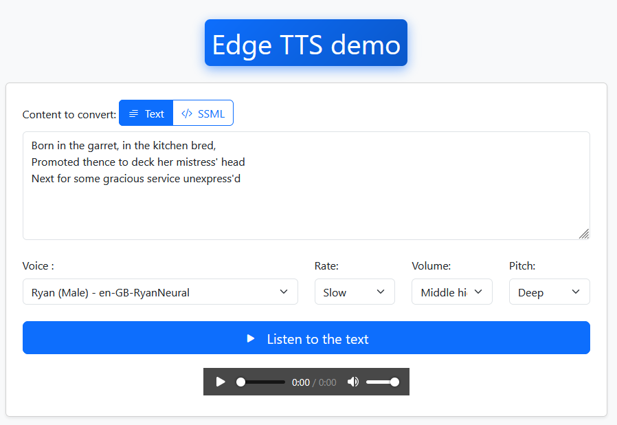

# Bestmomo/Laravel-Edge-TTS

A simple yet powerful Laravel package for integrating **Microsoft Edge Text-to-Speech (TTS)** into your applications. It features **audio streaming**, **caching**, **abstraction**, and **security** controls.

This package relies on the excellent work of [andresayac/edge-tts-php](https://github.com/andresayac/edge-tts-php) to interface with the Microsoft Edge TTS API. All voice support and core synthesis features are inherited from this library.

## Installation

### 1. Via Composer

Add the package to your Laravel project:

    composer require bestmomo/laravel-edge-tts

### 2. File Publication

After installation, publish the configuration file:

    php artisan vendor:publish --tag=edge-tts-config

This copies the `config/edge-tts.php` file, where you can define the default voice and security settings (middlewares).

## Configuration

### The `config/edge-tts.php` File

The configuration file allows you to customize key aspects of the package:

    return [
        // Default voice used if none is specified in the request
        'default_voice' => env('EDGE_TTS_DEFAULT_VOICE', 'fr-FR-DeniseNeural'),
    
        // Middlewares applied to the streaming route
        'middleware' => [
            'web',          // Required for session (and therefore 'auth') to work
            'auth',         // Require the user to be logged in
            'throttle:60,1',// Limit to 60 requests per minute
        ],
        
        // Audio caching parameters
        'cache' => [
            'enabled' => env('EDGE_TTS_CACHE_ENABLED', true),
            // Laravel storage disk to use for MP3 files (defaults to 'local')
            'disk' => env('EDGE_TTS_CACHE_DISK', 'local'),
            'lifetime' => env('EDGE_TTS_CACHE_LIFETIME', null), // Cache lifetime in minutes (null = indefinite)
        ],

        // Enable Call Logging
        'enable_call_logging' => env('EDGE_TTS_LOG_CALLS', false),
    ];

## Usage

The package registers an abstraction contract (Interface) and a Facade, allowing you to use it easily anywhere in your application.

### 1. Using the Contract (Dependency Injection)

The recommended approach is to inject the `TtsSynthesizer` contract:

    use Bestmomo\LaravelEdgeTts\Contracts\TtsSynthesizer;

    class MyService
    {
        protected $tts;
    
        public function __construct(TtsSynthesizer $tts)
        {
            $this->tts = $tts;
        }
    
        public function generateAudio()
        {
            // 1. Save the audio to a file:
            $filePath = $this->tts->toFile(
                'This is a file save test.', 
                'en-US-JennyNeural', 
                storage_path('app/audio/test_jenny')
            );
    
            // 2. Get the audio as a Base64 string:
            $base64 = $this->tts->toBase64('This is Base64 encoded audio.', 'en-US-JennyNeural');
        }
    }

### 1.1 Using the Facade

You can also use the `EdgeTts` facade to access the TTS synthesizer:

    use Bestmomo\LaravelEdgeTts\Facades\EdgeTts;

    class MyService
    {
        public function generateAudio()
        {
            // 1. Save the audio to a file:
            $filePath = EdgeTts::toFile(
                'This is a file save test.', 
                'en-US-JennyNeural', 
                storage_path('app/audio/test_jenny')
            );
    
            // 2. Get the audio as a Base64 string:
            $base64 = EdgeTts::toBase64('This is Base64 encoded audio.', 'en-US-JennyNeural');
        }
    }

### 2. Using the Streaming Route

The core of the package is the audio streaming route, which handles caching and security:

**Route URL:**

    /edge-tts/stream

**Route Name:**

    edge-tts.stream

You can use it directly in your JavaScript code for an `<audio>` element:

    const text = "Hello world!";
    const streamUrl = `/edge-tts/stream?text=${encodeURIComponent(text)}&voice=en-US-JennyNeural`;
    
    document.getElementById('audioPlayer').src = streamUrl;
    document.getElementById('audioPlayer').play();

**Query Parameters:**

* `text` the text to synthesize (can be SSML). (Required)
* `voice` the voice to use. (default defined in config)
* `rate`  speech rate (e.g., `+10%`, `-5%`). Default `0%`
* `volume` voice volume (e.g., `+50%`, `-10%`). Default `0%`
* `pitch` voice pitch (e.g., `+5Hz`, `-2Hz`). Default `0Hz`

**SSML Note:** If the `text` parameter starts with `<speak`, it will be interpreted as **SSML (Speech Synthesis Markup Language)**, allowing for advanced control over pauses, emphasis, and emotion. The simple modulation parameters (`rate`, `volume`, `pitch`) will be ignored in favor of the SSML tags.
For example:

    <speak version="1.0" xml:lang="en-US">
        <voice xml:lang="en-US" xml:gender="Female" name="en-US-JennyNeural">
            <prosody rate="+10%" volume="+50%" pitch="+5Hz">
                Hello world!
            </prosody>
        </voice>
    </speak>

### 3. Using the Blade Directive

For even simpler integration into your Blade templates, the package provides an `@edge_tts` directive. It generates an `<audio>` element configured for streaming.

**Basic Usage:**

```blade
{{-- Synthesize text with the default voice --}}
@edge_tts('text' => 'Hello world!')
```

**Usage with Specific Voice and Parameters:**

The directive accepts the same parameters as the streaming route, passed as arguments: `text`, `voice`, `rate`, `volume`, and `pitch`.

```blade
{{-- Synthesize in French with specific options --}}
@edge_tts([
    'text' => 'Bonjour le monde !', 
    'voice' => 'fr-FR-DeniseNeural',
    'rate' => '+10%'
])
```

This makes it incredibly easy to embed synthesized audio directly into your views.


## Key Features

### Caching

The package uses the `edge-tts.cache` configuration to cache generated audio files. If the exact same combination of **(text, voice, options)** is requested multiple times, the MP3 file is served instantly from local storage, reducing latency and external API requests.

### Enable Call Logging

The `enable_call_logging` option in the `config/edge-tts.php` file allows you to log every TTS API call to the Laravel log. This can be useful for debugging purposes or to monitor the usage of the TTS service.

To enable it, set the `EDGE_TTS_LOG_CALLS` environment variable to `true` in your `.env` file:

    EDGE_TTS_LOG_CALLS=true

### Cache Pruning

The package includes an Artisan command to automatically delete old cache files:

    php artisan edge-tts:cache-prune

By default, the command deletes files older than 90 days. You can customize this duration using the `--days` option:

    // Delete files older than 30 days
    php artisan edge-tts:cache-prune --days=30

To schedule it, add the following to your `routes/console.php` file:

```php
use Illuminate\Support\Facades\Schedule;

Schedule::command('edge-tts:cache-prune --days=60')->daily();
```

### Abstraction

The package utilizes a `TtsSynthesizer` contract. If you ever need to change the TTS provider (e.g., to Google Cloud TTS or Amazon Polly), you only need to create a new adapter implementing this contract and update the Service Provider binding, without changing your application's business logic.

### Demo (Development Environment)

You can access the demonstration interface (available only in `local`, `staging`, or `testing` environments):

    /edge-tts/demo



## Contributing

Contributions are welcome! Please open an issue or submit a pull request with your improvements.

## License

This package is open-source software licensed under the **MIT** license.